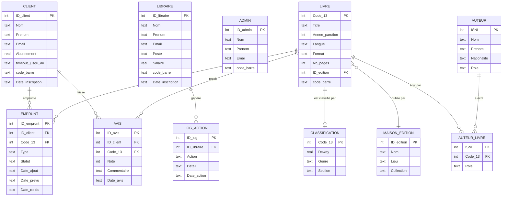

# DESIGN.md — Document de conception

## 1. Description des entités et de leurs relations

### Entités principales

#### `Client`
Représente les emprunteurs de la bibliothèque.

| Colonne | Type | Description |
|---------|------|-------------|
| ID_client | INTEGER PK | Identifiant unique auto-incrémenté |
| Nom | TEXT | Nom de famille |
| Prenom | TEXT | Prénom |
| Email | TEXT UNIQUE | Adresse email (optionnelle) |
| Mot_de_passe | TEXT | Mot de passe hashé (SHA-256) |
| Abonnement | REAL | Montant mensuel (défaut : 10.00 €) |
| timeout_jusqu_au | TEXT | Date de suspension du compte |
| code_barre | TEXT UNIQUE | Code unique 15 caractères pour scan |
| Date_inscription | TEXT | Date d'inscription |

---

#### `Libraire`
Représente le personnel de la bibliothèque.

| Colonne | Type | Description |
|---------|------|-------------|
| ID_libraire | INTEGER PK | Identifiant unique auto-incrémenté |
| Nom | TEXT | Nom de famille |
| Prenom | TEXT | Prénom |
| Email | TEXT UNIQUE | Adresse email |
| Mot_de_passe | TEXT | Mot de passe hashé |
| Poste | TEXT | Intitulé du poste (défaut : Libraire) |
| Salaire | REAL | Salaire mensuel (défaut : 1800.00 €) |
| code_barre | TEXT UNIQUE | Code unique 15 caractères pour scan |
| Date_inscription | TEXT | Date d'embauche |

---

#### `Admin`
Représente les super-administrateurs du système.

| Colonne | Type | Description |
|---------|------|-------------|
| ID_admin | INTEGER PK | Identifiant unique auto-incrémenté |
| Nom | TEXT | Nom de famille |
| Prenom | TEXT | Prénom |
| Email | TEXT UNIQUE | Adresse email |
| Mot_de_passe | TEXT | Mot de passe hashé |
| code_barre | TEXT UNIQUE | Code unique 15 caractères pour scan |
| Date_inscription | TEXT | Date de création du compte |

---

#### `Livre`
Représente le catalogue des livres disponibles.

| Colonne | Type | Description |
|---------|------|-------------|
| Code_13 | INTEGER PK | ISBN-13 (identifiant international) |
| Titre | TEXT | Titre du livre |
| Annee_parution | INTEGER | Année de publication |
| Langue | TEXT | Langue du livre |
| Format | TEXT | Format physique (Poche, Grand format…) |
| Nb_pages | INTEGER | Nombre de pages |
| ID_edition | INTEGER FK | Référence vers Maison_edition |
| code_barre | TEXT UNIQUE | Code unique 15 caractères pour scan |

---

#### `Auteur`
Représente les auteurs des livres.

| Colonne | Type | Description |
|---------|------|-------------|
| ISNI | INTEGER PK | Identifiant international de l'auteur |
| Nom | TEXT | Nom de famille |
| Prenom | TEXT | Prénom |
| Pseudo | TEXT | Pseudonyme éventuel |
| Date_naissance | TEXT | Date de naissance |
| Nationalite | TEXT | Nationalité |
| Role | TEXT | Rôle principal (Auteur, Traducteur…) |

---

#### `Auteur_Livre` *(table de jonction)*
Relie les auteurs aux livres — relation N:N.

| Colonne | Type | Description |
|---------|------|-------------|
| ISNI | INTEGER FK | Référence vers Auteur |
| Code_13 | INTEGER FK | Référence vers Livre |
| Role | TEXT | Rôle spécifique sur ce livre |

---

#### `Maison_edition`
Représente les éditeurs et leurs collections.

| Colonne | Type | Description |
|---------|------|-------------|
| ID_edition | INTEGER PK | Identifiant auto-incrémenté |
| Nom | TEXT | Nom de la maison d'édition |
| Lieu | TEXT | Ville du siège |
| Collection | TEXT | Nom de la collection |

---

#### `Classification`
Contient la classification Dewey et le genre de chaque livre — relation 1:1 avec Livre.

| Colonne | Type | Description |
|---------|------|-------------|
| Code_13 | INTEGER PK FK | Référence vers Livre |
| Dewey | REAL | Indice de classification Dewey |
| Genre | TEXT | Genre littéraire |
| Section | TEXT | Section de la bibliothèque |

---

#### `Emprunt`
Gère les emprunts et la liste de souhaits. C'est la table la plus active du système.

| Colonne | Type | Description |
|---------|------|-------------|
| ID_emprunt | INTEGER PK | Identifiant auto-incrémenté |
| ID_client | INTEGER FK | Référence vers Client |
| Code_13 | INTEGER FK | Référence vers Livre |
| Type | TEXT | `emprunt` ou `souhait` |
| Date_ajout | TEXT | Date de création (défaut : aujourd'hui) |
| Date_prevu | TEXT | Date de retour prévue (+30 jours) |
| Date_rendu | TEXT | Date de retour effective |
| Statut | TEXT | `en cours`, `retour_demande`, `rendu`, `en attente` |

---

#### `Avis`
Contient les notes et commentaires laissés par les clients.

| Colonne | Type | Description |
|---------|------|-------------|
| ID_avis | INTEGER PK | Identifiant auto-incrémenté |
| ID_client | INTEGER FK | Référence vers Client |
| Code_13 | INTEGER FK | Référence vers Livre |
| Note | INTEGER | Note de 1 à 5 |
| Commentaire | TEXT | Texte libre |
| Date_avis | TEXT | Date de l'avis |

Contrainte : un client ne peut laisser qu'un seul avis par livre (`UNIQUE (ID_client, Code_13)`).

---

#### `Log_action`
Trace toutes les actions effectuées par les libraires.

| Colonne | Type | Description |
|---------|------|-------------|
| ID_log | INTEGER PK | Identifiant auto-incrémenté |
| ID_libraire | INTEGER FK | Référence vers Libraire |
| Action | TEXT | Type d'action (`ajout_livre`, `retour_confirme`…) |
| Detail | TEXT | Description détaillée |
| Date_action | TEXT | Horodatage de l'action |

---

## 2. Diagramme Entité-Relation (ER)

---

## 3. Choix de conception

### Pourquoi SQLite ?
SQLite est une base de données embarquée — elle ne nécessite aucun serveur, aucune installation séparée, et fonctionne à partir d'un simple fichier `.db`. C'est le choix idéal pour un projet local ou scolaire où la simplicité de déploiement prime.

### Pourquoi trois tables utilisateurs séparées (`Client`, `Libraire`, `Admin`) ?
Une approche courante serait d'utiliser une seule table `Utilisateur` avec une colonne `role`. Nous avons préféré trois tables distinctes pour plusieurs raisons :
- **Clarté** : chaque table ne contient que les colonnes pertinentes à son rôle (`Salaire` et `Poste` uniquement pour `Libraire`, `Abonnement` uniquement pour `Client`)
- **Sécurité logique** : un client ne peut jamais accéder aux données d'un libraire et vice versa — les requêtes SQL ne croisent jamais les tables par erreur
- **Extensibilité** : ajouter des attributs spécifiques à un rôle ne pollue pas les autres

### Pourquoi l'ISBN-13 comme clé primaire de `Livre` ?
L'ISBN-13 est un identifiant international standardisé, unique pour chaque édition d'un livre. L'utiliser comme clé primaire évite de créer un ID artificiel et garantit l'unicité naturelle des entrées.

### Pourquoi une table de jonction `Auteur_Livre` ?
Un livre peut avoir plusieurs auteurs (co-auteurs, traducteurs, illustrateurs) et un auteur peut avoir écrit plusieurs livres. Cette relation N:N ne peut pas être représentée par une simple colonne — la table de jonction avec sa propre colonne `Role` permet de préciser le rôle de chaque auteur sur chaque livre.

### Pourquoi `code_barre` dans chaque table utilisateur et dans `Livre` ?
Le système de scan par code barre est le mécanisme central d'interaction. Stocker un code unique de 15 caractères dans chaque entité permet une recherche O(1) par index, sans avoir à interpréter un préfixe ou une structure dans le code lui-même. Chaque code est généré de façon cryptographiquement aléatoire pour éviter les collisions.

### Pourquoi le statut `retour_demande` dans `Emprunt` ?
Le retour d'un livre en bibliothèque est un acte physique qui nécessite une vérification par le personnel. Plutôt que de marquer un livre comme `rendu` dès que le client scanne, nous avons introduit un état intermédiaire `retour_demande` qui déclenche une notification côté libraire. Cette conception reflète le flux réel d'une bibliothèque.

### Types de données
- **TEXT pour les dates** : SQLite n'a pas de type DATE natif. Stocker les dates en format ISO 8601 (`YYYY-MM-DD`) en TEXT permet les comparaisons lexicographiques directes (`date('now')`, `<`, `>`) sans conversion.
- **REAL pour les montants** : les salaires et abonnements sont stockés en REAL (virgule flottante) — suffisant pour des valeurs monétaires simples à deux décimales.
- **INTEGER pour les notes** : les avis vont de 1 à 5, un entier est naturellement adapté.

---

## 4. Limitations connues du modèle

### Exemplaires uniques
Le modèle suppose qu'il n'existe **qu'un seul exemplaire physique** de chaque livre (identifié par son ISBN). Une vraie bibliothèque possède souvent plusieurs exemplaires du même titre. Pour gérer cela, il faudrait une table `Exemplaire` intermédiaire entre `Livre` et `Emprunt`.

### Gestion des mots de passe
Les mots de passe sont hashés avec SHA-256 sans salage (*salt*). En production, il faudrait utiliser une fonction dédiée comme `bcrypt` ou `argon2` avec sel pour résister aux attaques par table arc-en-ciel.

### Pas de gestion des retards
Le modèle stocke une `Date_prevu` mais ne déclenche pas automatiquement de pénalités ou notifications en cas de retard. Un système de tâches planifiées (*cron job*) serait nécessaire pour automatiser ces alertes.

### Recherche limitée
La recherche de livres s'effectue par correspondance partielle sur le titre, l'auteur et le genre (`LIKE`). Il n'y a pas de recherche plein texte (*full-text search*), de synonymes ou de correction orthographique.

### Pas de gestion multi-bibliothèques
Le système est conçu pour une seule bibliothèque. Une extension multi-sites nécessiterait une table `Bibliotheque` et des relations supplémentaires sur chaque entité.

### Abonnement non facturé
Le champ `Abonnement` stocke le montant mensuel mais il n'y a pas de module de facturation, de suivi des paiements, ni de relances automatiques.
